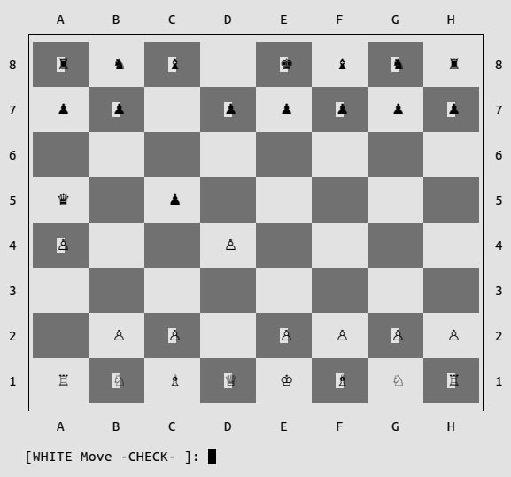

# chess

This is the final Ruby project from [The Odin Project](http://www.theodinproject.com/courses/ruby-programming/lessons/ruby-final-project).

Quick gameplay with a checkmate:

You cannot move a piece if it puts you in check:

When a player is in check:

