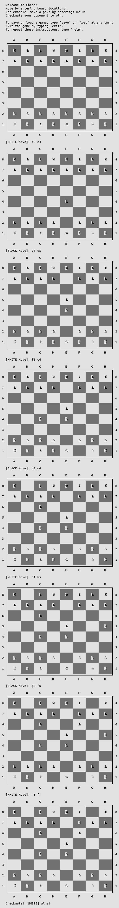

# chess

This is the final Ruby project from [The Odin Project](http://www.theodinproject.com/courses/ruby-programming/lessons/ruby-final-project).

Run this game by executing `ruby chess.rb`

In this implementation, the current player is determined by checking the turn count. White goes first, so it's white's move on every even turn.

The main loop begins by checking if the current player has met the stalemate condition. A stalemate occurs when the player is unable to move any pieces without going into check.

The program then looks to see if the player is in check. This is done by collecting all of the enemy's valid moves and comparing them against the current player's king's location.

If the player has met both the stalemate and check conditions, then it's a loss by checkmate.

Each move is tested for validity by passing through these conditions:
* There is a friendly piece at the starting location
* The end location doesn't have a friendly piece
* The end location is within the piece's moveset
* There is line of sight to the end location
* The move will not put the player in check

Pawns have a number of special conditions:
* Black can only move down vertically
* White can only move up vertically
* Can't move vertically if blocked by an enemy
* Can only attack diagonally
* Can move 2 spaces on the first move if they have line of sight

Moves are parsed through regular expression capture. An input is fine as long as it begins and ends with a valid location on the grid (i.e. "d2 d4", "d2 to d4", "D2D4" will all work).

A status is displayed when a player is in check:

You cannot move a piece if it puts you in check:

The game ends if a player cannot move without putting him/herself in check:

A look at a quick checkmate:

Not yet implemented:
* En passant
* Castling
